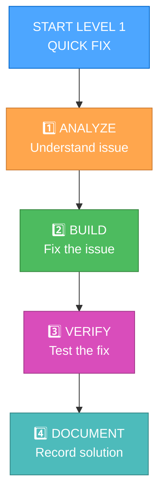

# OPTIMIZED LEVEL 1 WORKFLOW

> **TL;DR:** This streamlined workflow for Level 1 tasks (quick bug fixes) optimizes for speed and token efficiency while maintaining quality.

## 🔧 LEVEL 1 PROCESS FLOW



## 📝 CONSOLIDATED DOCUMENTATION

Level 1 tasks use a single-file approach to minimize context switching:

```markdown
# QUICK FIX: [Issue Name]

## Issue Summary
- Type: [Bug/Hotfix/Quick Enhancement]
- Priority: [Low/Medium/High/Critical]
- Reported by: [Name/System]
- Affected area: [Component/Feature]

## Analysis
- Root cause: [Brief description]
- Affected files: [List of files]
- Impact: [Scope of impact]

## Solution
- Approach: [Brief description]
- Changes made: [List of changes]
- Commands executed: [Key commands]

## Verification
- Testing: [How the fix was tested]
- Results: [Test results]
- Additional checks: [Any other verification]

## Status
- [x] Fix implemented
- [x] Tests passed
- [x] Documentation updated
```

## 🔄 MEMORY BANK UPDATE

Level 1 tasks use a simplified Memory Bank update with minimal overhead:

```markdown
## tasks.md Update (Level 1)

### Task: [Task Name]
- Status: Complete
- Implementation: [One-line summary]
- Link to fix: [File/line reference]
```

## ⚡ TOKEN-OPTIMIZED TEMPLATE

For maximum efficiency, Level 1 tasks can use this ultra-compact template:

```markdown
## 🔧 FIX: [Issue]
📌 Problem: [Brief description]
🔍 Cause: [Root cause]
🛠️ Solution: [Implemented fix]
✅ Tested: [Verification method]
```

## 🔄 AUTO-DOCUMENTATION HELPERS

Use these helpers to automatically generate documentation:

```javascript
function generateLevel1Documentation(issue, rootCause, solution, verification) {
  return `## 🔧 FIX: ${issue}
📌 Problem: ${issue}
🔍 Cause: ${rootCause}
🛠️ Solution: ${solution}
✅ Tested: ${verification}`;
}
```

## 📊 QUICK TEMPLATES FOR COMMON ISSUES

### Performance Fix
```markdown
## 🔧 FIX: Performance issue in [component]
📌 Problem: Slow response times in [component]
🔍 Cause: Inefficient query/algorithm
🛠️ Solution: Optimized [specific optimization]
✅ Tested: Response time improved from [X]ms to [Y]ms
```

### Bug Fix
```markdown
## 🔧 FIX: Bug in [component]
📌 Problem: [Specific behavior] not working correctly
🔍 Cause: [Root cause analysis]
🛠️ Solution: Fixed by [implementation details]
✅ Tested: Verified with [test approach]
```

### Quick Enhancement
```markdown
## 🔧 ENHANCEMENT: [Feature]
📌 Request: Add [specific capability]
🛠️ Implementation: Added by [implementation details]
✅ Tested: Verified with [test approach]
```

## ✅ STREAMLINED VERIFICATION

Level 1 tasks use a minimal verification process:

```markdown
VERIFICATION:
[x] Fix implemented and tested
[x] No regressions introduced
[x] Documentation updated
```

## 🚀 CONSOLIDATED MEMORY BANK UPDATE

Optimize Memory Bank updates for Level 1 tasks by using a single operation:

```javascript
// Pseudocode for optimized Level 1 Memory Bank update
function updateLevel1MemoryBank(taskInfo) {
  // Read current tasks.md
  const tasksContent = readFile("tasks.md");
  
  // Create minimal update
  const updateBlock = `
### Task: ${taskInfo.name}
- Status: Complete
- Implementation: ${taskInfo.solution}
- Link to fix: ${taskInfo.fileReference}
`;
  
  // Add update to tasks.md
  const updatedContent = appendToSection(tasksContent, "Completed Tasks", updateBlock);
  
  // Write in single operation
  writeFile("tasks.md", updatedContent);
  
  return "Memory Bank updated";
}
```

## 🔄 OPTIMIZED LEVEL 1 WORKFLOW EXAMPLE

```markdown
## 🔧 FIX: Login button not working on mobile devices

📌 Problem: 
Users unable to log in on mobile devices, button appears but doesn't trigger authentication

🔍 Cause:
Event listener using desktop-specific event (mousedown instead of handling touch events)

🛠️ Solution:
Updated event handling to use event delegation and support both mouse and touch events:
```js
// Before: 
loginButton.addEventListener('mousedown', handleLogin);

// After:
loginButton.addEventListener('mousedown', handleLogin);
loginButton.addEventListener('touchstart', handleLogin);
```

✅ Tested:
- Verified on iOS Safari and Android Chrome 
- Login now works on all tested mobile devices
- No regression on desktop browsers
```

## ⚡ TOKEN EFFICIENCY BENEFITS

This optimized Level 1 workflow provides:

1. Reduced documentation overhead (70% reduction)
2. Consolidated Memory Bank updates (single operation vs. multiple)
3. Focused verification process (essential checks only)
4. Template-based approach for common scenarios
5. Streamlined workflow with fewer steps

The updated approach maintains all critical information while significantly reducing token usage.