# COMPREHENSIVE WORKFLOW FOR LEVEL 4 TASKS

> **TL;DR:** This document outlines a comprehensive workflow for Level 4 (Complex System) tasks, including 8 key phases with rigorous planning, mandatory creative phases, architectural design, phased implementation, a dedicated SECURITY gate, and extensive documentation.

## 🔍 LEVEL 4 WORKFLOW OVERVIEW

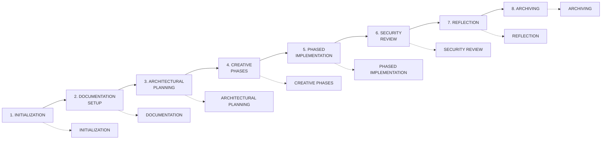

## 🔄 LEVEL TRANSITION HANDLING

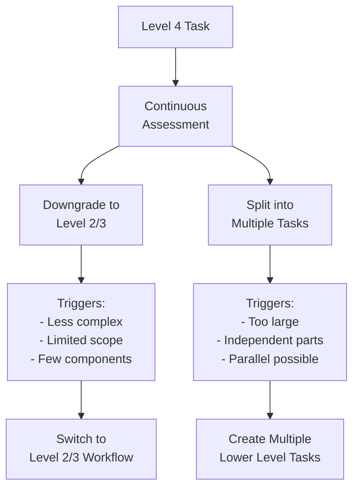

Level 4 tasks involve complex systems that require comprehensive planning, rigorous design, systematic implementation, and thorough documentation. This workflow ensures all aspects are addressed with the appropriate level of detail, structure, and verification.

## 📋 WORKFLOW PHASES

### Phase 1: INITIALIZATION

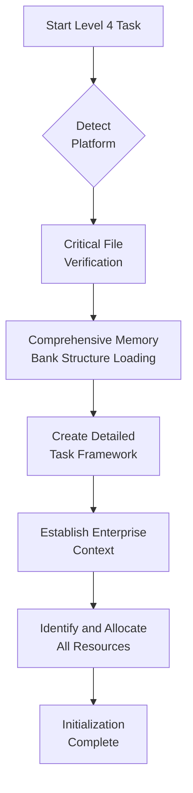

**Steps:**
1. Platform detection with comprehensive environment configuration
2. Critical file verification with in-depth integrity checks
3. Comprehensive Memory Bank structure loading with full reference mapping
4. Create detailed task framework in tasks.md with full structure
5. Establish complete enterprise context and stakeholder requirements
6. Identify and allocate all necessary resources (technical, human, time)
7. Perform system readiness assessment

**Milestone Checkpoint:**
```
✓ INITIALIZATION CHECKPOINT
- Platform detected and fully configured? [YES/NO]
- Critical files verified with integrity checks? [YES/NO]
- Memory Bank comprehensively loaded and mapped? [YES/NO]
- Detailed task framework created? [YES/NO]
- Enterprise context established? [YES/NO]
- Stakeholder requirements documented? [YES/NO]
- All resources identified and allocated? [YES/NO]
- System readiness assessed? [YES/NO]

→ If all YES: Proceed to Documentation Setup
→ If any NO: Complete initialization steps
```

### Phase 2: DOCUMENTATION SETUP

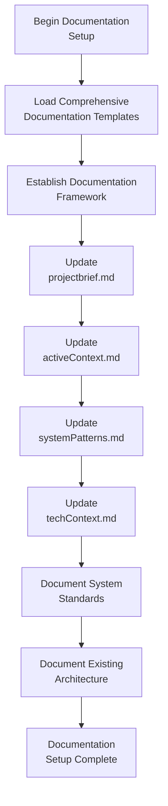

**Steps:**
1. Load comprehensive documentation templates for all aspects
2. Establish complete documentation framework with structure
3. Update projectbrief.md with detailed system description and requirements
4. Update activeContext.md with current focus, dependencies, and stakeholders
5. Update systemPatterns.md with comprehensive patterns and principles
6. Update techContext.md with complete technical landscape
7. Document system standards, constraints, and conventions
8. Document existing architecture and integration points

**Milestone Checkpoint:**
```
✓ DOCUMENTATION CHECKPOINT
- Documentation templates loaded? [YES/NO]
- Documentation framework established? [YES/NO]
- projectbrief.md comprehensively updated? [YES/NO]
- activeContext.md fully updated? [YES/NO]
- systemPatterns.md comprehensively updated? [YES/NO]
- techContext.md fully updated? [YES/NO]
- System standards documented? [YES/NO]
- Existing architecture documented? [YES/NO]

→ If all YES: Proceed to Architectural Planning
→ If any NO: Complete documentation setup
```

### Phase 3: ARCHITECTURAL PLANNING

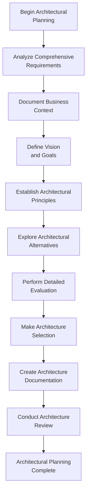

**Steps:**
1. Analyze comprehensive requirements with traceability
2. Document complete business context and constraints
3. Define clear vision and goals with measurable objectives
4. Establish architectural principles and non-functional requirements
5. Explore multiple architectural alternatives with thorough analysis
6. Perform detailed evaluation using weighted criteria
7. Make architecture selection with comprehensive justification
8. Create complete architecture documentation with diagrams
9. Conduct formal architecture review with stakeholders

**Milestone Checkpoint:**
```
✓ ARCHITECTURAL PLANNING CHECKPOINT
- Requirements comprehensively analyzed? [YES/NO]
- Business context fully documented? [YES/NO]
- Vision and goals clearly defined? [YES/NO]
- Architectural principles established? [YES/NO]
- Alternatives thoroughly explored? [YES/NO]
- Detailed evaluation performed? [YES/NO]
- Architecture selection justified? [YES/NO]
- Architecture documentation complete? [YES/NO]
- Architecture review conducted? [YES/NO]

→ If all YES: Proceed to Creative Phases
→ If any NO: Complete architectural planning
```

### Phase 4: CREATIVE PHASES

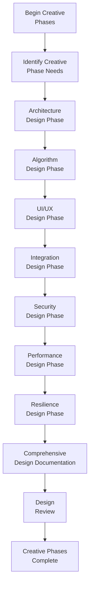

**Steps:**
1. Identify all required creative phases based on system needs
2. Execute comprehensive Architecture Design with patterns and principles
3. Conduct thorough Algorithm Design for all complex processes
4. Perform detailed UI/UX Design with user research and testing
5. Create Integration Design for all system interfaces
6. Develop Security Design with threat modeling
7. Design for Performance with capacity planning
8. Plan for Resilience with failure modes and recovery
9. Create comprehensive design documentation for all aspects
10. Conduct formal design review with stakeholders

**Milestone Checkpoint:**
```
✓ CREATIVE PHASES CHECKPOINT
- All required creative phases identified? [YES/NO]
- Architecture design completed with patterns? [YES/NO]
- Algorithm design conducted for complex processes? [YES/NO]
- UI/UX design performed with user research? [YES/NO]
- Integration design created for interfaces? [YES/NO]
- Security design developed with threat modeling? [YES/NO]
- Performance design completed with capacity planning? [YES/NO]
- Resilience design planned with failure modes? [YES/NO]
- Comprehensive design documentation created? [YES/NO]
- Formal design review conducted? [YES/NO]

→ If all YES: Proceed to Phased Implementation
→ If any NO: Complete creative phases
```

### Phase 5: PHASED IMPLEMENTATION

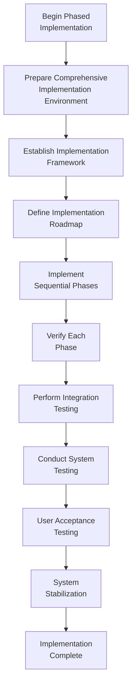

**Steps:**
1. Prepare comprehensive implementation environment with all tools
2. Establish implementation framework with standards and processes
3. Define detailed implementation roadmap with phases and dependencies
4. Implement sequential phases with milestone verification
5. Verify each phase against requirements and design
6. Perform comprehensive integration testing across phases
7. Conduct thorough system testing of the complete solution
8. Execute formal user acceptance testing with stakeholders
9. Perform system stabilization and performance tuning
10. Document all implementation details and deployment procedures

**Milestone Checkpoint:**
```
✓ PHASED IMPLEMENTATION CHECKPOINT
- Implementation environment fully prepared? [YES/NO]
- Implementation framework established? [YES/NO]
- Detailed roadmap defined with phases? [YES/NO]
- All phases sequentially implemented? [YES/NO]
- Each phase verified against requirements? [YES/NO]
- Comprehensive integration testing performed? [YES/NO]
- Thorough system testing conducted? [YES/NO]
- User acceptance testing executed? [YES/NO]
- System stabilization completed? [YES/NO]
- Implementation details documented? [YES/NO]

→ If all YES: Proceed to Security Review
→ If any NO: Complete implementation steps
```

### Phase 6: SECURITY REVIEW

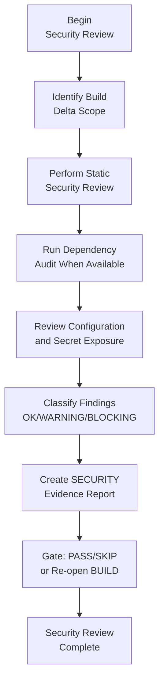

**Steps:**
1. Load the SecurityPhase shared and Level 4 audit rules.
2. Identify the BUILD delta from the task base commit and BUILD pipeline logs.
3. Audit authentication/authorization, secrets, input validation/injection, untrusted-data boundaries, dependency drift, logging/PII, and configuration drift.
4. Store evidence under `memory-bank/security/artifacts/[task-id]/attempt-[N]/`.
5. Create `memory-bank/security/security-[task-id].md` with the canonical verdict and findings.
6. If blocking findings exist, re-open BUILD using metadata (`SECURITY Last Verdict`, `SECURITY Attempts`, `SECURITY Last Report`) without adding new Phase Status enum values.
7. If passed or skipped, proceed to Reflection.

**Milestone Checkpoint:**
```
✓ SECURITY REVIEW CHECKPOINT
- BUILD delta scope identified? [YES/NO]
- Security audit checklist completed? [YES/NO]
- Dependency/configuration checks attempted or degraded with rationale? [YES/NO]
- SECURITY report created? [YES/NO]
- Blocking findings resolved or routed back to BUILD? [YES/NO]
- SECURITY Phase Status and metadata updated? [YES/NO]

→ If all YES: Proceed to Reflection
→ If any NO: Complete security review or BUILD re-entry steps
```

### Phase 7: REFLECTION

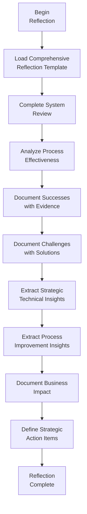

**Steps:**
1. Load comprehensive reflection template with all sections
2. Conduct complete system review against original goals
3. Analyze process effectiveness with metrics
4. Document successes with concrete evidence and impact
5. Document challenges with implemented solutions and lessons
6. Extract strategic technical insights for enterprise knowledge
7. Extract process improvement insights for future projects
8. Document business impact and value delivered
9. Define strategic action items with prioritization
10. Create comprehensive reflection documentation

**Milestone Checkpoint:**
```
✓ REFLECTION CHECKPOINT
- Comprehensive reflection template loaded? [YES/NO]
- Complete system review conducted? [YES/NO]
- Process effectiveness analyzed? [YES/NO]
- Successes documented with evidence? [YES/NO]
- Challenges documented with solutions? [YES/NO]
- Strategic technical insights extracted? [YES/NO]
- Process improvement insights extracted? [YES/NO]
- Business impact documented? [YES/NO]
- Strategic action items defined? [YES/NO]
- Comprehensive reflection documentation created? [YES/NO]

→ If all YES: Proceed to Archiving
→ If any NO: Complete reflection steps
```

### Phase 8: ARCHIVING

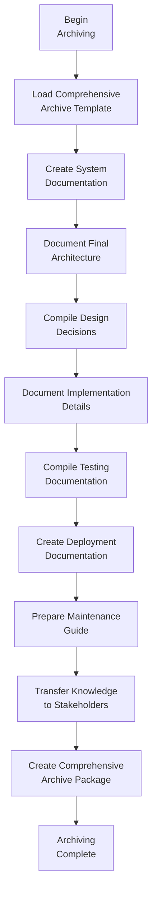

**Steps:**
1. Load comprehensive archive template with all sections
2. Create complete system documentation with all aspects
3. Document final architecture with diagrams and rationales
4. Compile all design decisions with justifications
5. Document all implementation details with technical specifics
6. Compile comprehensive testing documentation with results
7. Create detailed deployment documentation with procedures
8. Prepare maintenance guide with operational procedures
9. Transfer knowledge to all stakeholders with training
10. Create comprehensive archive package with all artifacts

**Milestone Checkpoint:**
```
✓ ARCHIVING CHECKPOINT
- Comprehensive archive template loaded? [YES/NO]
- Complete system documentation created? [YES/NO]
- Final architecture documented? [YES/NO]
- Design decisions compiled? [YES/NO]
- Implementation details documented? [YES/NO]
- Testing documentation compiled? [YES/NO]
- Deployment documentation created? [YES/NO]
- Maintenance guide prepared? [YES/NO]
- Knowledge transferred to stakeholders? [YES/NO]
- Comprehensive archive package created? [YES/NO]

→ If all YES: Task Complete
→ If any NO: Complete archiving steps
```

## 📋 WORKFLOW VERIFICATION CHECKLIST

```
✓ FINAL WORKFLOW VERIFICATION
- All 8 phases completed? [YES/NO]
- All milestone checkpoints passed? [YES/NO]
- Architectural planning properly executed? [YES/NO]
- All required creative phases completed? [YES/NO]
- Implementation performed in proper phases? [YES/NO]
- Comprehensive reflection conducted? [YES/NO]
- Complete system documentation archived? [YES/NO]
- Memory Bank fully updated? [YES/NO]
- Knowledge successfully transferred? [YES/NO]

→ If all YES: Level 4 Task Successfully Completed
→ If any NO: Address outstanding items
```

## 📋 MINIMAL MODE WORKFLOW

For minimal mode, use this streamlined workflow while retaining key elements:

```
1. INIT: Verify environment, create structured task framework, establish context
2. DOCS: Update all Memory Bank documents, document standards and architecture
3. PLAN: Define architecture with principles, alternatives, evaluation, selection
4. CREATE: Execute all required creative phases with documentation
5. IMPL: Implement in phases with verification, integration, testing
6. SECURITY: Audit implementation delta and record evidence/findings
7. REFLECT: Document successes, challenges, insights, and strategic actions
8. ARCHIVE: Create comprehensive documentation and knowledge transfer
```

## 🔄 INTEGRATION WITH MEMORY BANK

This workflow integrates comprehensively with Memory Bank:

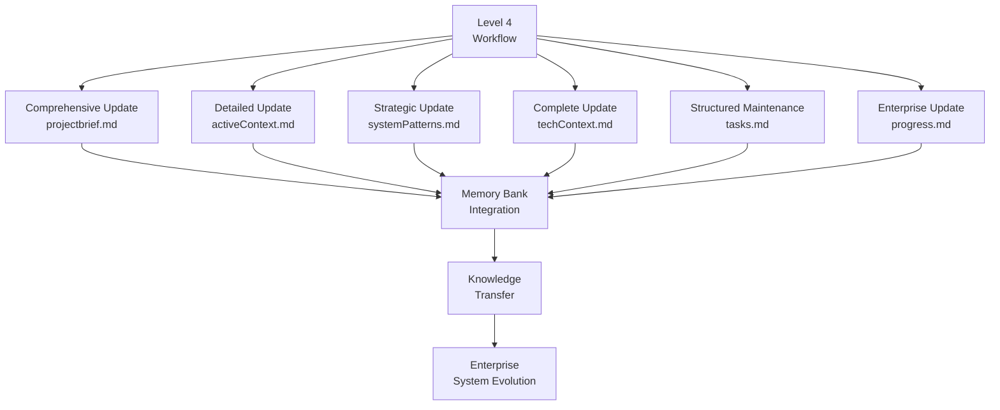

## 🚨 LEVEL 4 GOVERNANCE PRINCIPLE

Remember:

```
┌─────────────────────────────────────────────────────┐
│ Level 4 tasks represent ENTERPRISE-CRITICAL work.   │
│ RIGOROUS governance, comprehensive documentation,   │
│ and thorough verification are MANDATORY at each     │
│ phase. NO EXCEPTIONS.                               │
└─────────────────────────────────────────────────────┘
```

This ensures that complex systems are designed, implemented, and documented to the highest standards, with enterprise-grade quality and governance. 
